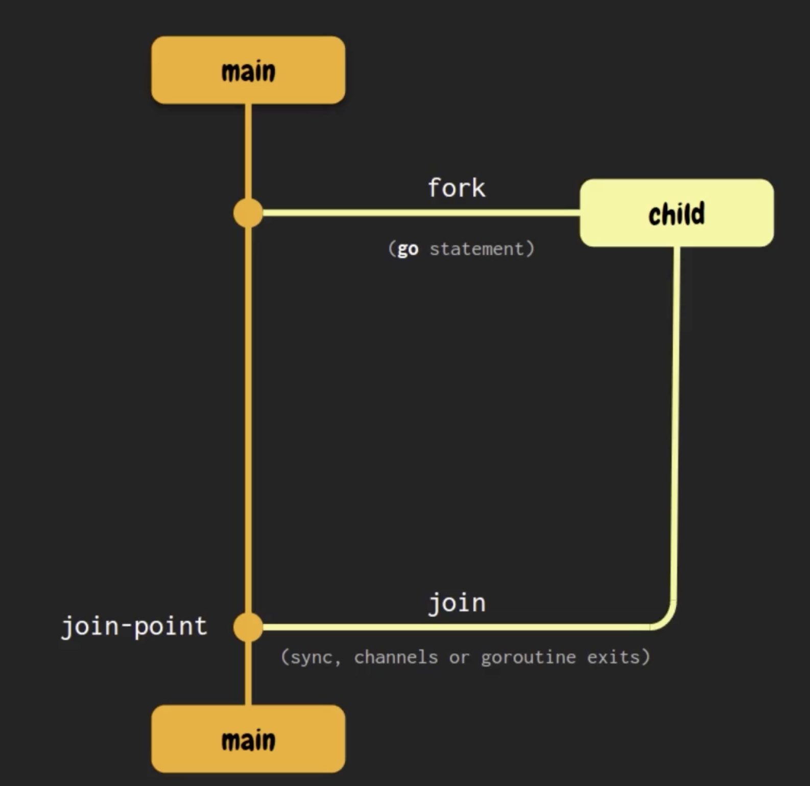

# Concurrency

Is the ability to handle multiple tasks by interleaving their execution. It means: structuring the application so that multiple independent processes or operations can run at the same time conceptually.

- Deals with multiple tasks making progress simultaneously, not necessarily at the same instant.
- It's about managing multiple tasks logically
- Go emphasizes concurrency with goroutines and channels.

In other hand, `Parallelism` refers to executing tasks simultaneously by leveraging multiple processors or cores. It physically runs more than one operation at the exact same instant.

- Requires hardware support (multiple cores or processors)
- Aims for increased performance through simultaneous execution
- In Go, parallelism is achieved by having multiple goroutines execute simultaneously on separate cores (configured by `GOMAXPROCS`)

| ASPECT | CONCURRENCY                                 | PARALLELISM                                                   |
| -------|---------------------------------------------|---------------------------------------------------------------|
| CONCEPT | Tasks run independently, managed logically  | Tasks run simultaneously, physically                          |
| HARDWARE | Can be achieved on single-core CPUs         | Requires multi-core CPUs                                      |
| GOAL | Structuring tasks for efficient utilization | Speed up execution by simultaneous use of hardware resources. | 
| Go EXAMPLE | Goroutines and Channels                     | Goroutines with `GOMAXPROCS > 1`                              |

So, **Concurrency** is structuring tasks to handle multiple things efficiently, and **Parallelism** is running multiple tasks simultaneously.

## Goroutines

Goroutines are lightweight threads managed by Go’s runtime. They execute functions or methods concurrently and independently, yet share the same memory space with other goroutines. Because of this shared memory space, communication and synchronization between goroutines is typically managed through channels or synchronization primitives like mutexes.

To create a goroutine:

```Go
go MyFunction()
```

## Fork Join Model

Every Go program always has a Goroutine (main). When we execute the command `go run main.go` we create the goroutine main to execute the main function.



- **Fork**: At any point in the program, a new execution branch (a child goroutine) can be created and run concurrently with its parent (typically the main goroutine).

- **Join**: At some point — we don't always know exactly when — the concurrent execution branches need to merge back. A **rendezvous point** refers to the moment when the parent and child goroutines synchronize. To achieve this, we must explicitly synchronize them using tools like the `sync` package (e.g., `WaitGroup`), channels, or simply by letting the child goroutine finish execution, which implicitly allows the parent to continue.

It's important to use a rendezvous point to synchronize the goroutines, not wait until the child goroutine ends. We cannot get the return values between goroutine father and child, for that we can use `Channels` and `Primitives from the package Sync`. We can also use anonymous functions with goroutines.

## Ways to work with Concurrency in Go

Go provides two ways to work with concurrency

1. (Low Level) Syncing memory access (traditional concurrency) via `Sync package` **WaitGroup** **Mutex**, we don't need communication, we only want to asure that a group of goroutines end their execution (WaitGroup). Only one goroutine can access to one variable at a time to avoid issues (Mutex).
2. (High Level), via CSP Model `(Sequential Communication Processes)`, we have `Channels` with **Range and Close** and **Select**. Are excellent to communication between goroutines.

*Don't communicate sharing memory, share memory communicating*.

## Concurrency problems

### Data Race

Happens when two goroutines access to the same variable at the same time and at least one of the access is `write` access.

```Go
package sample

import "fmt"

func main() {
	data := 1
	
	go func(){
		data++
    }()
	
	fmt.Println(data)
}
```

#### What’s happening?
1. `data := 1` — initializes data to 1.
2. A goroutine is started to increment data `(data++)`, but…
3. The main goroutine doesn't wait for the other goroutine to finish.
4. `fmt.Println(data)` runs almost immediately — before the goroutine gets a chance to run.

#### So what’s the issue?

The program might print 1 or 2, depending on the scheduler. This is a data race because two goroutines (main and the anonymous one) access the same variable concurrently, and at least one is writing.
This breaks Go’s memory safety model unless properly synchronized.

### Race Condition

A race condition occurs when two or more operations must be executed in a specific order, but the program does not guarantee that this order will be respected. As a result, the outcome may vary depending on how the operations are scheduled at runtime.

```Go
package transfer

func transfer(amount int, source, desc *account) {
	if source.balance < amount {
		return
    }
	
	desc.balance += amount
	source.balance -= amount
}
```

if we execute that function as goroutine... well will be in front of a **Race Condition**.

### Deadlock

A deadlock occurs when a group of goroutines wait on each other in a way that none of them can proceed.

```Go
func main(){
	message := make(chan string)
	
	go func() {
		fmt.Println(<-message)
    }()
	
	fmt.Println(<-message)
}
```

1. `message := make(chan string)` creates an unbuffered channel.
2. Both the main goroutine and the anonymous goroutine are trying to receive from the channel:
   - fmt.Println(<-message) in both places.
3. But no goroutine ever sends anything into the channel (message <- "hello" or similar).
4. As a result, both goroutines are blocked waiting to receive, and no one sends → deadlock.

### Livelock

A livelock occurs when concurrent operations are actively running, but none of them make progress because they keep reacting to each other without advancing the program's state.

```Go
package main

import (
	"fmt"
	"time"
)

type hallway struct {
	gopherCrossing *gopher
}

func (s hallway) crossing() {
	fmt.Printf("%s has crossing!\n", s.gopherCrossing.name)
}

type gopher struct {
	name           string
	isNeedCrossing bool
}

func (g *gopher) walk(hallway *hallway, otherGopher *gopher) {
	for g.isNeedCrossing {
		if hallway.gopherCrossing != g {
			time.Sleep(1 * time.Millisecond * 100)
			continue
		}

		// if otherGopher.isNeedCrossing {
		// 	fmt.Printf("%s: please, You crossing first %s!\n", g.name, otherGopher.name)
		// 	hallway.gopherCrossing = otherGopher
		// 	continue
		// }

		hallway.crossing()
		g.isNeedCrossing = false
		fmt.Printf("%s: I have crossed the hallway, thanks you %s!\n", g.name, otherGopher.name)
		hallway.gopherCrossing = otherGopher
		return
	}
}

func main() {
	gopherPurple := &gopher{
		name:           "Gopher Purple",
		isNeedCrossing: true,
	}

	gopherGreen := &gopher{
		name:           "Gopher Green",
		isNeedCrossing: true,
	}

	hallway := &hallway{gopherCrossing: gopherPurple}

	go func() {
		gopherPurple.walk(hallway, gopherGreen)
	}()

	go func() {
		gopherGreen.walk(hallway, gopherPurple)
	}()

	time.Sleep(time.Second) // hack
}
```

These are the hardest bugs in concurrency to identify!

| Aspect | Behavior |
| -- | -- |
| Concept shown |	Livelock (when if block is uncommented) |
| Why?	| Gophers politely give way to each other infinitely |
| Fix?	| Add randomness, backoff, or break the cycle |

### Starvation

Starvation is a situation where a concurrent process is unable to gain regular access to the resources it needs to perform its work, and therefore cannot make progress.
This happens when one or more greedy concurrent processes unfairly prevent other processes from accessing resources efficiently — or from progressing at all.

### Concurrency Problems in Go – Summary Table

| Problem       | Definition                                                                 | Possible Solution                                     |
|---------------|------------------------------------------------------------------------------------|--------------------------------------------------------|
| **Data Race** | Two goroutines access the same variable at the same time, one of them writing.   | Use sync primitives (`sync.Mutex`, `sync.WaitGroup`), or channels. |
| **Race Condition** | Program outcome depends on timing/order of operations that aren't guaranteed.     | Synchronize operations using locks or channels.        |
| **Deadlock**   | Goroutines wait on each other and none can proceed.                              | Ensure at least one goroutine can progress; use timeouts or buffered channels. |
| **Livelock**   | Goroutines actively run but keep yielding to each other without making progress. | Add randomness, backoff strategy, or limit retries.    |
| **Starvation** | A goroutine waits indefinitely because others hog the resources.                | Use fair scheduling, avoid greedy locking or resource monopolization. |