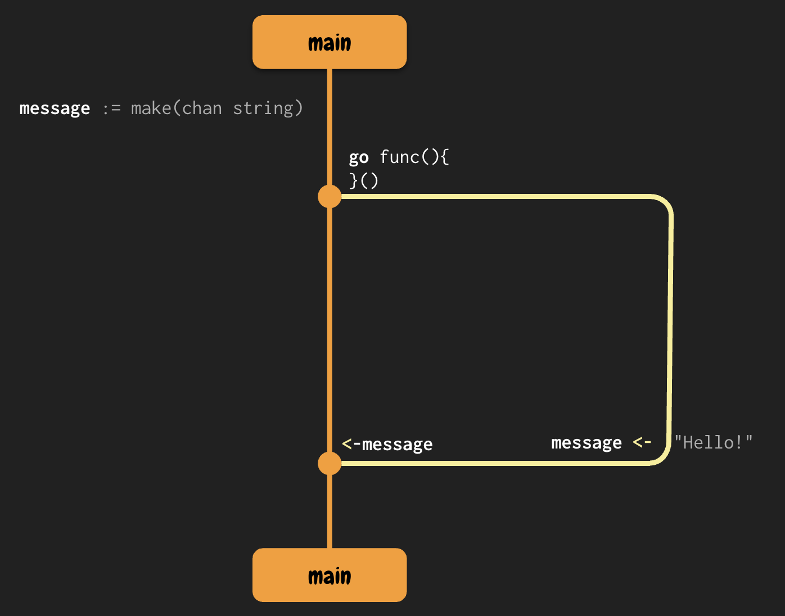

# Sharing Memory for Communication

## CSP Model

The Communication Sequential Processes refers to a model of concurrent computation where independent processes exchange messages to communicate with each other. In this model, each process has its own memory space and data is exchanged between processors through message sending and receiving. Was created by `Tony Hoare (1978)` **(must exists I/O Primitives for Concurrent Processes)**.

- `!` is used to send information to a process
- `?` is used to read the output process
- `->` is the protected command:
  - `Guard(Conditional) -> Declaration`: the conditional guarantees that when is true, the declaration executes. (aiming).

```shell
p1?c -> p2!c
```

1. P1 output is sent to a `c variable`
2. P2 Input is received from the same variable `c`

*Go based on CSP Model to implement channels in the language.*

## Channels

The communication by channel is the main method of syncing between goroutines. Are used to receive and send messages, using channels goroutines can be sync them. To create a channel we can:

```Go
ch := make(chan string)
```

To send information to a channel:

```Go
ch <- "Hello!"
```
the arrow indicate the data flow, where is aiming the arrow will be sending the data.

To receive from the channel and assign a value in a variable:

```Go
message := <-ch
```

When we are **working with channels**, **we don't need to explicitly state when we are locking or unlocking the data access**. Remember that the channel is used to share the memory to share the messages.

Sample via Fork Join Model:



> [!CAUTION]
> Deadlock bug can be created if we implement bad communication between channels as follows:

```Go
func main(){
	message := make(chan string)
	
	go func(){
		fmt.Println(<-message)
    }()
	
	fmt.Println(<-message)
}
```

So, both goroutines will be waiting to listening the message, are `blocked`.

### Directional Channels

Channels must have only a unidirectional direction (aiming).

```Go
package main

import "fmt"

func main() {
    number := make(chan int)	
	go receive(number)
	send(number)
}

func send(number chan int){
	number <- 10
}

func receive(number chan int){
	fmt.Println(<-number)
}
```

So, remember that a `channel` is a synchronization and communication mechanism used to safely pass data between goroutines. It can be thought of as a typed conduit through which values can be sent and received.

**Basic operations:**
- Send: `ch <- value` — sends a value into the channel ch.
- Receive: `value := <-ch` — receives a value from the channel ch.

**Important property:**
Channels in Go are blocking by default:
- A send blocks until another goroutine receives the value.
- A receive blocks until another goroutine sends a value.

This property ensures synchronization between goroutines.

**Design Principle:** In Go, unbuffered channels are used to enforce a rendezvous between goroutines: both sender and receiver must be ready for communication to succeed.

So to create the directional channels we can:

```Go
package main

import "fmt"

func main() {
    number := make(chan int)	
	go receive(number)
	send(number)
}

func send(number chan<- int){
	number <- 10
}

func receive(number <-chan int){
	fmt.Println(<-number)
}
```

The change lies in the function signatures:

- `send(number chan<- int)`
  - This function can only send values into the channel.
  - Trying to read from number inside this function will cause a compile-time error.

- `receive(number <-chan int)`
  - This function can only receive values from the channel.
  - Trying to write into number inside this function will also be a compile-time error.

| Type | 	Meaning               |
| -- |------------------------|
| chan T | 	Bidirectional channel |
| chan<- T | 	Send-only channel     |
| <-chan T | 	Receive-only channel  |

Those kinds of channels are highly recommended to accomplish the Single Responsibility Principle and also Prevents accidental reads/writes in the wrong direction.
Enforces the intended use of the channel. You can immediately tell from the function signature whether it’s a sender or a receiver.

*All these examples from channels are **Unbuffered Channels***

### Buffer Channels

In some cases, we need channels that do not block immediately. As previously explained, unbuffered channels block until a send and a receive operation are both ready. But what happens if the sending function produces data very quickly, while the receiving function takes longer to process it?
To handle such scenarios, Go provides buffered channels, which allow sending a limited number of values without requiring an immediate receiver.

A `buffer` is a temporary storage area used to hold data while it is being transferred from one place to another. In general terms a buffer allows the **producer** (sender) to continue working even if the **consumer** (receiver) isn't ready yet, it's commonly used to **decouple** the speed of production and consumption. In Go, a buffered channel allows asynchronous communication between goroutines by letting a fixed number of values be queued in the channel. This improves throughput and decouples producer-consumer timing, at the cost of added complexity in flow control.

In Go:

- Producer blocks until Buffer is full
- Consumer blocks when the buffer is empty

```go
number := make(chan int, 2)
```

That line creates a **buffered channel** of type `int` with a **capacity of 2**. The capacity means in this case that the channel has a buffer of size 2, which can store **up to 2 values** at a time **without blocking the sender**.

So: we can do **two sends** immediately, but if a third send is executed, it will **block until the receiver consumes at least one value**. Conversely, **a receiver will block only if the buffer is empty**.

#### The Signal Pattern in Go

In some cases, even if we use buffered channels, we still need to manage the timing between producers and consumers more explicitly — especially if we want to guarantee that all values sent are printed or processed before the program exits. For this purpose, Go allows us to implement what is commonly referred to as the **signal pattern**.

This pattern uses an additional channel to **signal when a consumer should stop** or when a producer should proceed. The signal is typically sent after a series of operations have completed.

A common practice is to use a channel of type `chan struct{}` for signaling. The `struct{}` type is used because it is an **empty struct**, meaning it **occupies zero bytes in memory**, making it an efficient way to transmit only the intent to signal — not data.

##### Example:

```go
signal := make(chan struct{})
go receive(signal, number)
...
signal <- struct{}{}
```

#### Why use the signal pattern?

- It allows the main goroutine or producer to notify the consumer that no more values will be sent.
- It avoids infinite loops or premature exits in concurrent programs.
- It ensures a graceful shutdown or controlled coordination between components.

This mechanism is essential when we want to guarantee that all sent values are received and processed, especially in scenarios where timing between goroutines is not deterministic.

By combining buffered channels and the signal pattern, Go provides developers with precise control over the flow and lifecycle of concurrent programs.

### The Close Pattern in Go

Another fundamental synchronization technique in Go is the **close pattern**, which uses the built-in `close()` function to notify receivers that no more values will be sent through a channel. This is especially useful when the receiver is looping over the channel using the `range` keyword.

Consider the following example:

```go
package main

import "fmt"

func main() {
	number := make(chan int, 3)
	signal := make(chan struct{})
	go receive(signal, number)
	send(number)

	<-signal
}

func send(number chan<- int) {
	number <- 1
	number <- 2
	number <- 3
	number <- 4
	number <- 5
	close(number)
}

func receive(signal chan struct{}, number <-chan int) {
	for v := range number {
		fmt.Println(v)
	}

	signal <- struct{}{}
}
```

In this program, the producer (`send`) sends five integer values through a **buffered channel** with a capacity of 3. This means that up to three values can be stored in the channel before the sender blocks. After all values have been sent, the `send` function calls `close(number)`. This **closes the channel**, which is Go’s way of signaling to the receiver that **no more values will be sent**.

In the `receive` function, the receiver uses `range number`, which reads from the channel until it is closed. This allows the receiver to process all values and then exit the loop cleanly. After exiting the loop, the receiver sends a signal on the `signal` channel to notify the main goroutine that it has finished processing.

This is called the **close pattern**, and it is especially useful in producer-consumer scenarios to achieve safe and graceful termination of the receiving logic. It guarantees that all sent values are received and that the consumer finishes only when appropriate.

### The For-Select Pattern in Go

Another powerful tool in Go’s concurrency model is the use of the **for-select pattern**, which allows a goroutine to react to multiple communication operations simultaneously. The `select` statement works like a `switch`, but is exclusive to channel operations.

In the following example, a `receiveSelectPattern` function continuously checks for two types of events:

- Incoming values on the `number` channel.
- A stop signal on the `signal` channel.

The use of `default` enables non-blocking behavior, so that the loop continues even when no values are available.

```go
package main

import (
	"fmt"
	"time"
)

func main() {
	number := make(chan int)
	signal := make(chan struct{})
	go receiveSelectPattern(signal, number)
	sendSelectPattern(number)

	signal <- struct{}{}
}

func sendSelectPattern(number chan<- int) {
	number <- 1
	number <- 2
	number <- 3
	number <- 4
	number <- 5
	time.Sleep(time.Nanosecond)
	number <- 6
}

func receiveSelectPattern(signal <-chan struct{}, number <-chan int) {
	for {
		select {
		case v := <-number:
			fmt.Println(v)
		case <-signal:
			return
		default:
			fmt.Println("🤔")
		}
	}
}
```

### How it works:
- The goroutine prints numbers as they become available from the `number` channel.
- If no value is available, the `default` case runs, printing "🤔".
- Once the main goroutine sends on the `signal` channel, the loop exits.

This pattern is particularly useful in non-blocking systems or when you want to add timeouts, cancellation, or perform background processing while still being responsive to input or control signals.

### Example Output:
```
1
2
🤔
🤔
🤔
🤔
🤔
🤔
🤔
🤔
3
4
5
🤔
🤔
🤔
🤔
🤔
🤔
6
```

The output shows how the `receiveSelectPattern` function continues to loop and print "🤔" when no values are available, then resumes printing numbers as they arrive. This makes the program more responsive and avoids blocking indefinitely on empty channels.

### Explicit Cancellation with Channel Close

In scenarios where long-running or slow goroutines may need to be canceled after a timeout or based on an external condition, Go supports a technique often referred to as **explicit cancellation**.

The idea is to create a shared channel, typically named `done`, which is **closed** when cancellation is needed. Each goroutine selects on this channel and returns early if the cancellation is triggered. This allows for **graceful termination** of concurrent operations.

Here is an example:

```go
package main

import (
	"log"
	"net/http"
	"sync"
	"time"
)

var urls = []string{
	"http://localhost:1234?duration=3s",
	"http://localhost:1234?duration=1s",
	"http://localhost:1234?duration=5s",
}

func main() {
	fetchConcurrentCancellation(urls)
}

func fetchConcurrentCancellation(urls []string) {
	done := make(chan struct{})

	for _, url := range urls {
		go func(u string) {
			fetch(u)
			select {
			case <-done:
				return
			}
		}(url)
	}

	select {
	case <-time.After(4 * time.Second):
		close(done)
	}
}

func fetch(url string) {
	resp, err := http.Head(url)
	if err != nil {
		log.Fatalf("failed url: %s, err: %v", url, err)
	}
	log.Println(url, ": ", resp.StatusCode)
}
```

In this example:
- A `done` channel is created to signal cancellation.
- Each goroutine calls `fetch()` and then blocks on `select` to check if `done` has been closed.
- The main goroutine waits for 4 seconds and then **closes the `done` channel**, signaling all running goroutines to stop.

This approach is especially useful in scenarios where you:
- Want to cancel ongoing work after a timeout.
- Want to prevent goroutines from running longer than necessary.
- Need a **graceful shutdown mechanism** in concurrent workflows.


