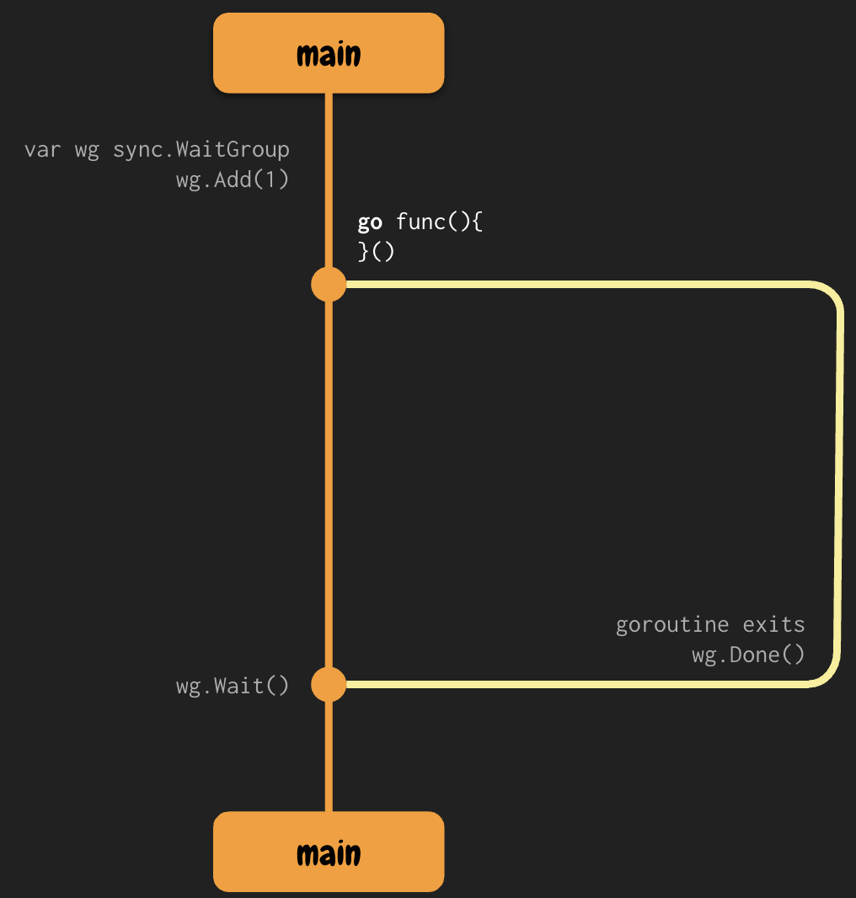

# Sync Memory Access

## Overview of the Fork-Join Model

The fork-join model is a widely used pattern in concurrent programming where execution forks into multiple concurrent tasks and later joins back when those tasks complete. This approach allows for concurrent task execution while maintaining control over synchronization and program correctness.

- **Fork**: Spawning concurrent tasks using goroutines.
- **Join**: Synchronizing and waiting for the completion of all tasks using `sync.WaitGroup`.

We can create a `rendezvous point` using the **sync.WaitGroup** package to handle that:

## Synchronization with sync.WaitGroup

The `sync.WaitGroup` type provides a way to wait for a collection of goroutines to finish executing. It is primarily used to implement the "join" part of the fork-join model.

### Key Methods:
- `Add(n int)`: Increments the counter by `n`, representing the number of goroutines to wait for.
- `Done()`: Decrements the counter. This should be called once by each goroutine when it completes its task.
- `Wait()`: Blocks the calling goroutine until the counter goes back to zero.

### Purpose:
- Prevent premature termination of the main goroutine while child goroutines are still running.
- Avoid the use of sleep-based hacks for synchronization.

### Concurrency Issue Prevented:
| Problem       | Description                                                         | Resolution with WaitGroup                |
|---------------|---------------------------------------------------------------------|-------------------------------------------|
| Goroutine termination | The main goroutine may exit before child goroutines finish their work. | `Wait()` ensures the main goroutine waits for all spawned goroutines. |

## Mutual Exclusion with sync.Mutex

The `sync.Mutex` type provides a locking mechanism to ensure that only one goroutine accesses a critical section of code at a time. It is used to avoid race conditions when goroutines read and write to shared variables.

### Key Methods:
- `Lock()`: Acquires the lock. If another goroutine holds the lock, the calling goroutine blocks until the lock is available.
- `Unlock()`: Releases the lock, allowing other goroutines to acquire it.

### Purpose:
- Protect shared memory from concurrent modification.
- Ensure that only one goroutine can modify a critical variable at any time.

### Concurrency Issue Prevented:
| Problem         | Description                                                               | Resolution with Mutex                    |
|-----------------|----------------------------------------------------------------------------|------------------------------------------|
| Race condition | Multiple goroutines access and modify shared state concurrently, leading to inconsistent state. | `Lock()` and `Unlock()` ensure exclusive access to shared resources. |

## Summary of Concurrency Problems Addressed

| Concurrency Issue | Description                                                             | Resolution                              |
|--------------------|-------------------------------------------------------------------------|------------------------------------------|
| Premature termination | Goroutines may not complete before the program exits.                   | Use `sync.WaitGroup` to wait for all goroutines. |
| Race condition     | Concurrent access to shared memory causes incorrect or unpredictable results. | Use `sync.Mutex` to serialize access.     |
